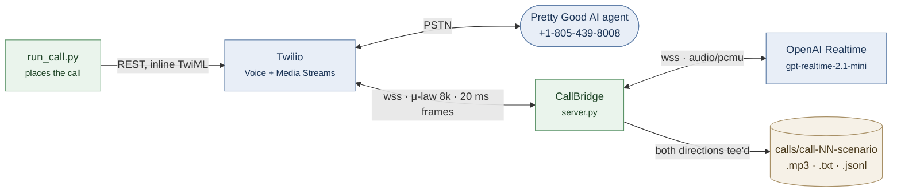

# Architecture

## How it works

`run_call.py` places an outbound call through Twilio's REST API with the TwiML passed
inline, so this repo never needs a public HTTP endpoint — only a websocket. The TwiML is
a single `<Connect><Stream>` pointing at `wss://<tunnel>/media-stream/<scenario>/<label>/<number>`.
When the Pretty Good AI agent answers, Twilio opens that socket and begins pushing 20ms
frames of G.711 mu-law at 8kHz. `server.py` compiles the named scenario's YAML into a
system prompt and hands it to `CallBridge`, which opens a second websocket to the OpenAI
Realtime API and configures the session for `audio/pcmu` in both directions. Three
asyncio tasks then run for the life of the call: one pump carrying Twilio frames up as
`input_audio_buffer.append`, one carrying `response.output_audio.delta` frames back down
inside a Twilio `media` envelope, and a watchdog that guarantees the call ends — on the
bot's own `end_call` tool, on dead air, or on a hard duration cap. Because both legs are
already mu-law 8kHz, **no audio is decoded, resampled or re-encoded anywhere in the hot
path**; the base64 payload is lifted out of one envelope and dropped into the other. The
same frames are tee'd into a stereo recorder (their agent left, our patient right) while
the Realtime API's transcription events build a transcript whose timestamps line up with
the resulting MP3.

## Why this way

The decision that mattered was speech-to-speech versus a cascading STT → LLM → TTS
pipeline, and the brief settled it: voice quality is graded before code, and awkward
pauses are named as a failure. A cascade adds a transcribe-then-think-then-synthesise
round trip landing around 800ms–1.5s, and it *sounds* like a bot waiting its turn. The
Realtime API holds ~660ms median across these 15 calls and keeps the prosody that makes a
caller read as human. Audio tokens cost far more than Whisper plus a small text model, but
over ~35 minutes of calls that difference is a few dollars against a $20 budget — the
wrong variable to optimise. I chose a raw websocket over Pipecat (the alternative, and my
fallback if the bridge had not worked by hour three) because the interesting failure here
is barge-in and I wanted to own it. It needs three things done together: a
`conversation.item.truncate` so the model does not believe it said words nobody heard, a
Twilio `clear` to flush the playout buffer, and a matching trim on the local recording.
Getting any one wrong is audible — and the Twilio `clear` has to be unconditional, because
generation finishes seconds before playback does, so the most common interruption arrives
when there is nothing left to truncate but plenty still queued in the far end's speaker.

## Data flow

Green is mine, blue is external, and the single arrow into storage is the point: both
audio directions pass through one process, so recording and transcription are a tee off
the live stream rather than a separate retrieval step. Both websocket legs carry G.711
mu-law at 8kHz, so **audio is never decoded, resampled or re-encoded** — the base64
payload moves from one envelope to the other untouched.

Inside `CallBridge`, three asyncio tasks run for the life of the call:

| Task | Responsibility |
|---|---|
| Twilio → OpenAI | `input_audio_buffer.append` per 20ms frame |
| OpenAI → Twilio | `response.output_audio.delta` wrapped in a `media` envelope |
| Watchdog | Ends the call on `end_call`, on dead air, or at the duration cap |

Barge-in spans both pumps: a Twilio `clear` to flush playout, a
`conversation.item.truncate` so the model does not believe it said unheard words, and a
matching trim on the recording.

## Tradeoffs I accepted

**Local + ngrok rather than a deployed server.** Iteration speed mattered more than a
stable URL for a one-day build, and I could watch frame-level logs while a call was live.
The cost is a tunnel host that rotates on restart and has to be re-copied into `.env`.

**Prompt-level steering rather than a scripted state machine.** Each scenario is a
persona, a goal, success criteria and a watch-list in YAML. A state machine over turns
would have fought the model's own sense of pacing and produced exactly the "scripted
benchmark runner" the brief warns against. The cost showed up immediately: when I tightened
the prompt to stop the bot padding its turns, it started dropping the *second* half of a
two-part goal — it asked for the meloxicam and never mentioned the oxycodone, which was
the entire point of that scenario. Naturalness and goal completion pull against each
other, and the fix was to make goal completion explicit rather than trade one for the other.

**Retry the control plane, not the media plane.** A dropped media websocket is a discarded
call; reconnecting mid-conversation and resyncing state costs more than re-running the
scenario. The REST calls that place and poll a call are different, and I learned that the
hard way — a single TCP reset while polling Twilio ended a twelve-call run at call four,
even though that call had already connected and been recorded. Status polls now tolerate
five consecutive failures with backoff, and a failed scenario is logged and skipped rather
than taking the queue down with it.

**Whisper for transcription, with a backstop.** The transcript is an artifact for humans,
not something the bot reasons over — it hears the raw audio directly. What mattered was
*completeness*: transcription lands well after the audio it describes, so closing the
session at hangup silently dropped the last few turns. One call had thirty seconds of agent
speech in the recording and no matching lines in the transcript. Teardown now commits any
uncommitted input audio and drains in-flight transcription events, and `analyze.py repair`
can rebuild either side from the recording if that ever fails.

**Measuring rather than eyeballing.** Reply latency is the headline finding, so it had to
be right, and I got it wrong twice. First by diffing consecutive transcript timestamps —
wrong, because the interval between two turns is mostly the length of the turn itself.
Then by clocking from `response.done` — also wrong, because that fires when generation
ends while Twilio is still playing several seconds of buffered audio, so I was counting my
own playout tail as their delay. It reported an 18-second silence on a call whose audio
contained no gap over 2.4 seconds, and that contradiction is what exposed it. The figure
now clocks from the Twilio `mark` that confirms playback finished, and I validated it
against the recordings by an entirely independent route — splitting the stereo channels by
frame energy and measuring the gaps acoustically. Those agreed, and only then did the
number go in the bug report.
