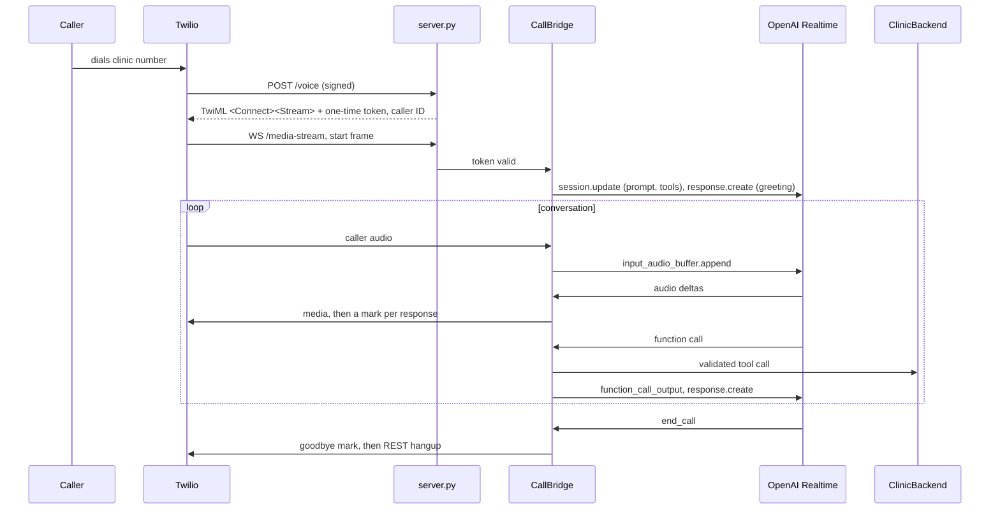

# Architecture

## Call flow

## Design decisions

**The bot speaks first.** Server VAD only creates responses after the caller talks, so
the bridge sends an explicit `response.create` with the greeting as soon as the session
is configured.

**Playback, not generation, decides who is speaking.** The model generates audio
faster than real time. `turns.py` treats the receptionist as audible until Twilio echoes
the mark sent after each response. That one rule drives barge-in (flush Twilio, truncate
the model's item, trim the recording, including during the buffered tail), and it is
where the caller's reply latency is clocked from.

**Validation in tools, recovery in the prompt.** A voice model cannot count digits it
heard or check that a date exists. Handlers validate and return short error codes
(`invalid_phone`, `slot_taken`, `system_unavailable`); the prompt says how to recover
from each. Slots carry a ready-made spoken label so the model never computes a weekday.

**The verified patient lives in the call context.** `lookup_patient` and
`save_new_patient` set `CallContext.patient_id`; booking, listing, rescheduling and
cancelling act on that patient only, and no tool takes a patient id from the model.
Lookups are capped at three per call, return no record details, and never say which
field failed to match. A new-patient save that matches an existing name and date of
birth is refused rather than attached.

**Tool calls do not block the audio pump.** Each runs as its own task with a timeout.
Outputs are sent when ready; once the response that requested them is done, the bridge
asks the model to continue. If the caller cut that response off, server VAD has already
started a new one, so no second `response.create` is sent.

**Authentication before cost.** `/voice` checks Twilio's signature against the public
URL. The TwiML carries a one-time token as a stream parameter, and `/media-stream` checks
it on Twilio's `start` frame before opening the OpenAI connection.

**PHI off by default.** Recording and transcript logging are opt-in, write outside
version control, and the console log carries tool names and outcomes, never arguments.

## Tradeoffs

- **Speech-to-speech over an STT, LLM, TTS cascade:** lower latency and more natural
  prosody; costs more per minute and gives less control over exact wording.
- **One process per server, state in memory:** the stream-token store and in-memory
  backend do not survive restarts or scale across instances. Fine for one clinic line;
  move tokens to a shared store before running more than one instance.
- **A dropped media socket ends the call.** Reconnecting mid-conversation is not
  attempted.

## Known gaps

- The production `ClinicBackend` adapter does not exist yet.
- Spelled names are matched exactly after normalisation; letters that sound alike over
  a phone line (M/N, B/D) will miss. Fuzzy last-name matching belongs in the adapter.
- No automated end-to-end voice test. The old patient-caller bot (git history) could be
  adapted to dial the receptionist with scripted personas.
